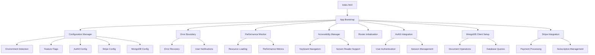

# Design Document

## Overview

Este diseño define la arquitectura optimizada para los archivos índice de Digital English Academy, enfocándose en mejorar el rendimiento, mantenibilidad, accesibilidad y experiencia de usuario. La solución mantiene la estructura modular existente mientras introduce mejoras significativas en la inicialización, manejo de errores y optimización de recursos.

## Architecture

### Core Components

1. **Enhanced Index.html**: Archivo HTML optimizado con mejor estructura semántica, meta tags mejorados, y estrategias de carga de recursos
2. **Application Bootstrap (app.js)**: Sistema de inicialización robusto con manejo de errores y carga progresiva
3. **Configuration Manager**: Sistema centralizado para manejar configuraciones de entorno
4. **Error Boundary System**: Manejo global de errores con recuperación automática
5. **Performance Monitor**: Sistema de métricas y optimización automática
6. **Accessibility Manager**: Controlador centralizado para funcionalidades de accesibilidad

### Architecture Diagram



## Components and Interfaces

### 1. Enhanced Index.html Structure

**Improvements:**

- Optimized meta tags for SEO and social sharing
- Improved resource loading with preload/prefetch strategies
- Better accessibility landmarks and ARIA labels
- Progressive enhancement approach
- Service worker registration for offline capabilities

**Key Features:**

- Critical CSS inlining for faster first paint
- Optimized font loading with font-display: swap
- Proper viewport configuration for all devices
- Structured data markup for search engines

### 2. Application Bootstrap System

**Interface:**

```javascript
class AppBootstrap {
  async initialize(config = {})
  async loadCriticalResources()
  async initializeModules()
  handleInitializationError(error)
  getInitializationStatus()
}
```

**Responsibilities:**

- Coordinated module initialization
- Dependency resolution and loading
- Error handling and recovery
- Performance monitoring during startup
- Progressive feature activation

### 3. Configuration Manager

**Interface:**

```javascript
class ConfigurationManager {
  loadEnvironmentConfig()
  validateConfiguration(config)
  getFeatureFlag(flagName)
  setDevelopmentMode(enabled)
  getSecureConfig(key)
}
```

**Features:**

- Environment-specific configuration loading
- Secure handling of sensitive data
- Feature flag management
- Configuration validation
- Runtime configuration updates

### 4. Error Boundary System

**Interface:**

```javascript
class ErrorBoundary {
  captureError(error, context)
  showUserFriendlyMessage(error)
  attemptRecovery(error)
  reportError(error, metadata)
  getErrorHistory()
}
```

**Capabilities:**

- Global error catching and handling
- User-friendly error messages
- Automatic recovery strategies
- Error reporting and analytics
- Graceful degradation

### 5. Performance Monitor

**Interface:**

```javascript
class PerformanceMonitor {
  trackPageLoad()
  measureResourceTiming()
  monitorMemoryUsage()
  optimizeResourceLoading()
  generatePerformanceReport()
}
```

**Metrics Tracked:**

- First Contentful Paint (FCP)
- Largest Contentful Paint (LCP)
- Cumulative Layout Shift (CLS)
- First Input Delay (FID)
- Resource loading times
- Memory usage patterns

### 6. Accessibility Manager

**Interface:**

```javascript
class AccessibilityManager {
  initializeKeyboardNavigation()
  setupScreenReaderSupport()
  manageColorContrast()
  handleFocusManagement()
  announcePageChanges()
}
```

**Features:**

- Keyboard navigation enhancement
- Screen reader announcements
- High contrast mode support
- Focus management across route changes
- ARIA live regions for dynamic content

### 7. Auth0 Integration Manager

**Interface:**

```javascript
class Auth0Manager {
  async initializeAuth0Client(config)
  async handleAuthCallback()
  async loginWithRedirect(options)
  async logout(options)
  async getUser()
  async getAccessToken()
  isAuthenticated()
  onAuthStateChange(callback)
}
```

**Features:**

- Secure authentication flow
- Session management
- Token refresh handling
- User profile management
- Role-based access control

### 8. Stripe Integration Manager

**Interface:**

```javascript
class StripeManager {
  initializeStripe(publishableKey)
  createPaymentIntent(amount, currency)
  handlePaymentSuccess(paymentIntent)
  redirectToCheckout(sessionId)
  createSubscription(priceId)
  cancelSubscription(subscriptionId)
  getCustomerPortalUrl()
}
```

**Features:**

- Secure payment processing
- Subscription management
- Customer portal integration
- Webhook handling
- Payment method management

### 9. MongoDB Integration Manager

**Interface:**

```javascript
class MongoDBManager {
  async initializeClient(connectionString)
  async connectToDatabase(dbName)
  async authenticateWithAuth0(token)
  async findDocuments(collection, query, options)
  async insertDocument(collection, document)
  async updateDocument(collection, filter, update)
  async deleteDocument(collection, filter)
  async aggregateData(collection, pipeline)
  async createIndex(collection, keys, options)
  async watchCollection(collection, callback)
}
```

**Features:**

- Secure MongoDB Atlas connection
- Auth0 integration for user management
- Document-based data operations
- Aggregation pipeline support
- Change streams for real-time updates
- Optimized indexing strategies

## Data Models

### Configuration Schema

```javascript
{
  environment: 'development' | 'staging' | 'production',
  auth0: {
    domain: string,
    clientId: string,
    audience?: string,
    scope: string,
    redirectUri: string,
    logoutUri: string
  },
  stripe: {
    publishableKey: string,
    paymentLinkUrl?: string,
    successUrl: string,
    cancelUrl: string
  },
  mongodb: {
    connectionString: string,
    databaseName: string,
    options: {
      retryWrites: boolean,
      w: string,
      appName: string
    }
  },
  features: {
    auth0: boolean,
    stripe: boolean,
    mongodb: boolean,
    analytics: boolean,
    serviceWorker: boolean,
    realtime: boolean
  },
  performance: {
    enableMetrics: boolean,
    reportingEndpoint: string,
    criticalResourceTimeout: number
  },
  accessibility: {
    enableEnhancements: boolean,
    announceRouteChanges: boolean,
    highContrastMode: boolean
  }
}
```

### Error Context Schema

```javascript
{
  timestamp: Date,
  errorType: string,
  message: string,
  stack: string,
  userAgent: string,
  url: string,
  userId?: string,
  sessionId: string,
  additionalContext: object
}
```

### Performance Metrics Schema

```javascript
{
  timestamp: Date,
  metrics: {
    fcp: number,
    lcp: number,
    cls: number,
    fid: number,
    ttfb: number
  },
  resources: Array<{
    name: string,
    duration: number,
    size: number,
    type: string
  }>,
  memory: {
    used: number,
    total: number
  }
}
```

## Error Handling

### Error Categories and Strategies

1. **Initialization Errors**
   - Missing dependencies: Show fallback UI with manual retry
   - Configuration errors: Use safe defaults and warn user
   - Network failures: Enable offline mode if available

2. **Runtime Errors**
   - JavaScript exceptions: Capture, report, and attempt recovery
   - Resource loading failures: Implement fallback resources
   - API failures: Show appropriate user messages and retry logic

3. **User Experience Errors**
   - Navigation failures: Redirect to safe route
   - Authentication issues: Clear session and redirect to login
   - Permission errors: Show appropriate access denied messages

### Recovery Mechanisms

- **Automatic Recovery**: For transient errors, implement exponential backoff retry
- **Graceful Degradation**: Disable non-critical features when dependencies fail
- **User-Initiated Recovery**: Provide clear actions users can take to resolve issues
- **Session Recovery**: Preserve user state across error recovery attempts

## Testing Strategy

### Unit Testing

- Configuration manager validation
- Error boundary error handling
- Performance monitor metric collection
- Accessibility manager feature detection

### Integration Testing

- Module initialization sequence
- Error propagation and handling
- Configuration loading across environments
- Resource loading optimization

### End-to-End Testing

- Complete application startup flow
- Error recovery scenarios
- Performance benchmarks
- Accessibility compliance testing

### Performance Testing

- Load time optimization validation
- Memory usage monitoring
- Resource loading efficiency
- Mobile device performance

### Accessibility Testing

- Keyboard navigation flows
- Screen reader compatibility
- Color contrast validation
- Focus management verification

### Browser Compatibility Testing

- Modern browser feature support
- Progressive enhancement validation
- Fallback mechanism testing
- Mobile browser optimization
